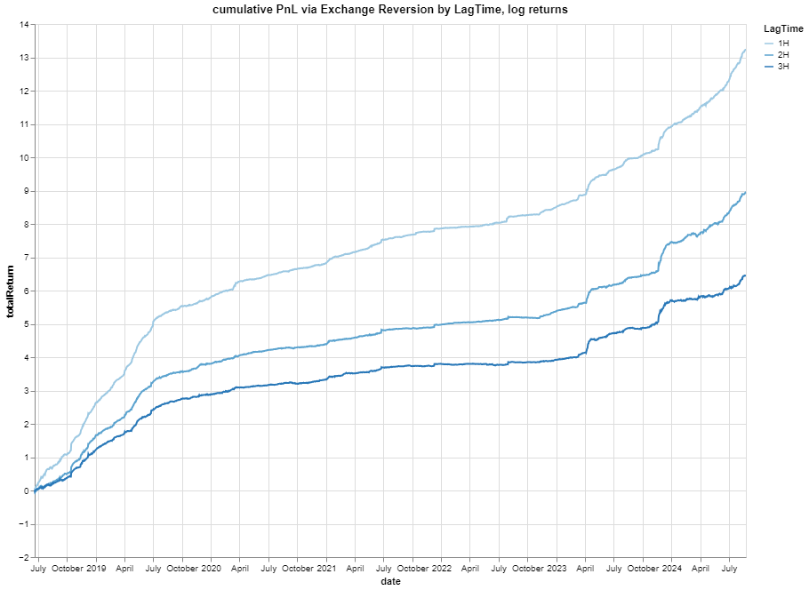

# Exchange Reverseion
This is a mean reversion strategy. The signal is based on cross-sectional exchange price differences. Pnl from backtests is provided, as well as a simple validation. 

## Assumptions

### Traded Pairs
USDT and USD are treated as equivalent
 - BTC/USD
 - ETH/USD

### Exchanges
 - Bitfinex
 - Bitstamp
 - Bittrex
 - CEX
 - Gemini
 - Poloniex

### Parameters
We fix a look-back period of 6 hours, with a varying lag of the signal. Eg, A lag of 1 hour with a 6 hour look-back means we take the oldest 6 hour period of a 7 hour window.

### Signal
The signal is constructed by taking the top/bottom 2 exchanges ranked via total returns in the look-back period. We then long/short the top 2 bottom/top exchanges.

## Data
Manually downloaded data from https://www.cryptodatadownload.com/data/

## Results
Given the chart below, we see that the strategy is indeed profitable (ignoring slippage and transaction costs).
Moreoever, we see that increasing lag time (how long we lag the signal) strongly implies a reduction in PnL. This observation provides a validation of the strat.

